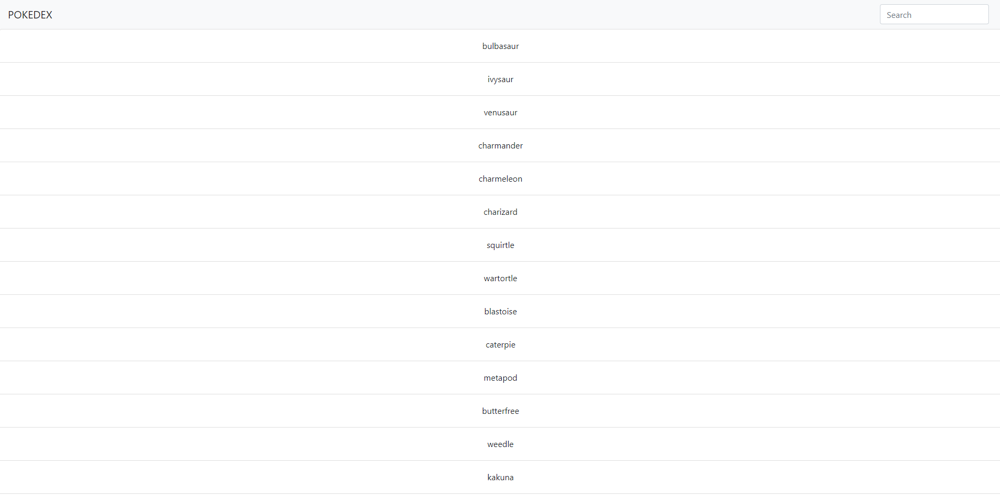

# js-app

The obejective was to create a Pokedex using JavaScript, HTML, and CSS. The application displays details that are fetched form an external API into a modal.

## Built With

- JavaScript
- jQuery
- HTML
- CSS
